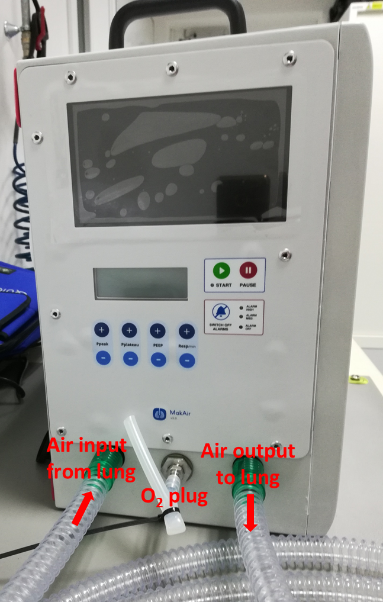
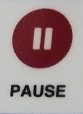

# RE20-Respirator-SW
All the files in this directory (and its subdirectories) are subject to the GPL V3 licence.

Pierre was here.

# MakAir RE20 by Renault   Ventilator 

Mass-producible open-source multi-usage ventilator.  

Aims at helping hospitals Worldwide to cope with a possible shortage of ventilators during future outbreaks. 

Hardware and software target to facilitate and spread Research and developments. 

Contributors are MakAir for life, Renault, Renault Sport and CEA. 

As to ensure best  international dissemination, most contents required to build your own MakAir RE20 by Renault ventilator are available in English. 

If you're new there, please read the explanations below. *Your contributions are much welcome!* 
 

## General informations : 

* Autonomous breathing apparatus regulated in gas pressure 

* Compressor capable of 100cm H2O / 100 l / min 

* Modular industrial design: 

* Possibility of enriching functions 

* Ability to adapt to different component supplies for the same function 

* Compatible with a large series assembly 

* Power supply on Mains and/or batteries 

* Transportable with an autonomy of 4 hours (air transport compatible batteries) 

* Reliability Target > 2000h 

* Overhaul / cleaning facilitated by the use of Pinch Valves 

* Manufacturing cost price between € 1000 and € 2,500 depending on version and volumes 

* Noise level less than 50 dB, capable of 40 dB (depending on ambient thermal conditions) 

 

## Functions 

* Pressure Controlled Forced Ventilation 

* pressure controled ventilation (PCV) 

* Capable of volume control (or PRVC)** 

* Respiratory assistance type PSV (Pressure Support Ventilation)** 

* Automatic switchover between PSV and PCV (PRVC)** 

* Cough management** 

* Hardware capable of complex assistance modes (ASV type)** 

* Measurement of inspiration gas flow rate, exhaled gas flow rate, inspired O2 flow rate**, FIO2 safety** 

* FIO2 display, inspiration pressure curves, inspiration gas flow rate, expiration, PEEP** 

* MIL type models (model in the loop) available on request 

* Open architecture allowing future developments in open source 

* Any control mode is a priori simulated / programmable 

* Models simulate the lungs of different types of patients 

 

** :   not implemented in 1.0.0 software --- most are documented but not implemented

***

# How to use the RSR RE20 respirator

## 1.	Summary of developments

**Version 1.0**
> 17/07/2020 : M. JACONELLI - Initial version

## 2.	Prerequisite
### 2.1	Document objective

This document is intended to explain how to use RSR RE20 respirator.
### 2.2	Before starting

In order to use RSR RE20 respirator, make sure you have:
-	A RSR RE20 respirator
-	An artificial lung
-	A "Y" fitting (for connection between lung and respirator)
-	A plug for O2 input

## 3.	RSR RE20 respirator use
### 3.1	RSR RE20 respirator connections

The artificial lung has to be connected to the respirator. To do so, it's connected to the surgical pipes through the "Y" fitting. It corresponds to the following picture:

The surgical pipes and O2 plug can now be connected to the RSR RE20 respirator front panel, according to the following picture:

***Remark***: **the 2 surgical pipes can be inverted when connecting to RSR RE20 respirator, there is no difference.**

Finally, RSR RE20 respirator can be plugged to electrical network.

### 3.2	RSR RE20 respirator start

When RSR RE20 respirator is plugged to electrical network, it can be switched on, by pressing the main switch located on the back panel (see above picture). 

Once RSR RE20 respirator is switched on, it goes through an initialization.
During this phase, LCD display displays the software version number:

When initialization is finished, system goes into "Wait mode", respirator is ready to be started:

Here is explanation of the LCD display content in "Wait mode":

***Remark***: 
-	Number of respiration cycles per minute can be set with "**Resp/min**" buttons
-	Pressure at the end of inhalation phase can be set with "**Pplateau**" buttons
-	Pressure at the end of exhalation phase can be set with "**PEEP**" buttons
-	"Ppeak" and "SWITCH OFF ALARMS" buttons are not used
-	Start and alarms LED are also not used

To start the RSR RE20 respirator, just press the start button 1 time:

Once RSR RE20 respirator is started, it goes to "Cycle mode" and displays the following:

***Remark***:
-	O2 rate displays "??" because this functionality is not implemented in v1.0.0 software.
-	**At the beginning, system will set an alarm (code 22), which is displayed on the second line of the LCD display, this alarm means that pressure in the system didn't reach the setpoint. This is normal and will disappear once system has reached the pressure setpoint.**

To stop the RSR RE20 respirator, just press the pause button **2 times**:

When stopped, the system goes back to "Wait mode", the RSR RE20 respirator can then be switched off using the main switch on the back panel.

